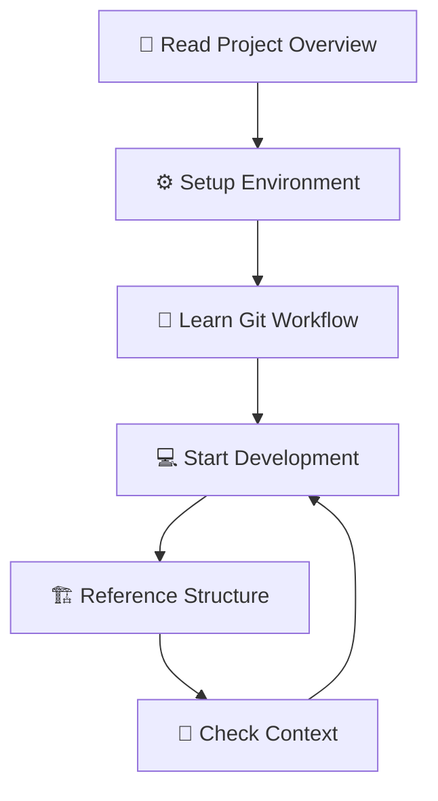

# 📚 Documentation Index

Welcome to the Legal AI Query & Referral System documentation. Follow this guide in order for the best onboarding experience.

## 🚀 Quick Start (New Team Members)

**Start here if you're new to the project:**

1. **[📖 Project Overview](../README.md)** - Understanding the project goals and team structure
2. **[⚙️ Development Setup](./01-setup.md)** - Get your development environment running
3. **[🌿 Git Workflow](./02-git-workflow.md)** - Learn our branching strategy and commit standards
4. **[💻 Development Guide](./03-development-guide.md)** - Daily development workflow and best practices

## 📋 Reference Documentation

**Use these for ongoing development:**

- **[🏗️ Project Structure](./04-project-structure.md)** - Codebase organization and architecture
- **[🤖 Project Context (CLAUDE.md)](../CLAUDE.md)** - Technical details and environment setup

## 🔄 Development Flow



## 📁 Documentation Organization

```
docs/
├── README.md                    # 📚 This index (start here)
├── 01-setup.md                  # ⚙️ Development environment setup
├── 02-git-workflow.md           # 🌿 Git branching and workflow
├── 03-development-guide.md      # 💻 Daily development practices
└── 04-project-structure.md     # 🏗️ Codebase organization

Root Files:
├── README.md                    # 📖 Project overview
├── CLAUDE.md                    # 🤖 Technical context and instructions
└── .github/
    └── pull_request_template.md # 📝 PR template
```

## 🎯 For Different Roles

### **New Developers**
1. Project Overview → Setup → Git Workflow → Development Guide

### **Code Reviewers**
- Git Workflow (PR requirements)
- Development Guide (quality standards)
- Project Structure (architecture understanding)

### **Project Management**
- Project Overview (goals and team)
- Git Workflow (process understanding)
- Project Structure (technical overview)

### **DevOps/Infrastructure**
- Setup Guide (environment configuration)
- Development Guide (CI/CD pipeline)
- Project Context (technical details)

## 🔗 External Resources

- **[Jira Board](https://itproject24.atlassian.net/)** - Sprint planning and ticket tracking
- **[Confluence](https://itproject24.atlassian.net/wiki/)** - Additional project documentation
- **GitHub Repository** - Source code and issues

## 📞 Getting Help

**Technical Questions:**
- **Frontend:** Farah (Frontend Lead)
- **Backend:** Himank (Backend Lead)
- **AI Service:** Yusuf (AI Lead)
- **Process:** Bryan (Scrum Master)
- **Requirements:** Adam (Product Owner)

**Documentation Issues:**
- Create an issue in the GitHub repository
- Tag the appropriate team lead
- Update documentation after resolution

---

**💡 Tip:** Bookmark this page and refer back to it regularly as your single source of truth for project documentation!